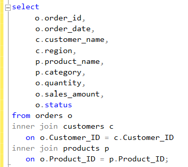
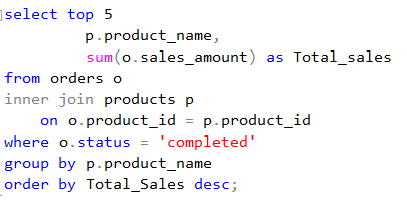
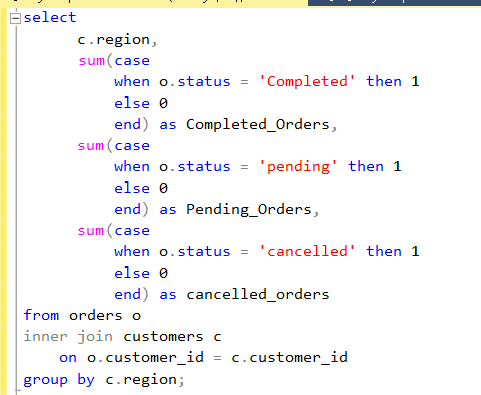
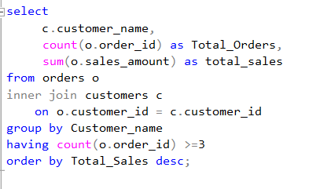
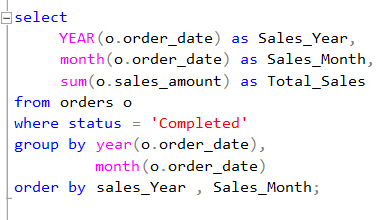
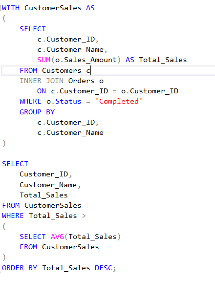

# Retail Sales Analysis | SQL

## Project Overview

This project analyzes retail sales data using Microsoft SQL Server.  
The objective is to answer common business questions related to sales performance, customers, products, regions, order status, and monthly trends using SQL.

The project includes **15 business analysis queries** along with advanced SQL examples using **CTEs and window functions**.

## Tools & Technologies

- Microsoft SQL Server
- SQL Server Management Studio (SSMS)
- Microsoft Excel
- SQL

## SQL Skills Demonstrated

- SELECT, WHERE and ORDER BY
- INNER JOIN and LEFT JOIN
- SUM, COUNT and AVG
- GROUP BY and HAVING
- CASE WHEN
- Conditional Aggregation
- Top-N Analysis
- Date Analysis using YEAR and MONTH
- Common Table Expressions (CTEs)
- DENSE_RANK()
- ROW_NUMBER()

## Dataset

The analysis uses three main tables:

- **Customers** — customer details, region and segment
- **Products** — product details, category and unit price
- **Orders** — transaction details including quantity, sales amount, status and payment mode

## Business Analysis Performed

The SQL analysis covers:

1. Combined order, customer and product details
2. Total sales, total orders and average order value
3. Completed sales by region
4. Completed sales by product category
5. Top 5 products by sales
6. Top 5 customers by sales
7. Order count by status
8. Completed, Pending and Cancelled orders by region
9. Customers with no orders
10. Products with no orders
11. Order value classification using CASE WHEN
12. Regions exceeding a completed-sales threshold
13. Customer order count and total sales analysis
14. Monthly completed-sales trend
15. Average completed sales by region

### Advanced SQL

Additional queries demonstrate:

- CTE-based customer sales analysis
- Product ranking using `DENSE_RANK()`
- Highest-value customer orders using `ROW_NUMBER()`

## Analysis Preview

### Three-Table JOIN

Combines Orders, Customers and Products to create a detailed sales view.

### Top 5 Products by Completed Sales

Uses aggregation, grouping and sorting to identify the highest-selling products.

### Order Status by Region

Uses `CASE WHEN` with conditional aggregation to compare Completed, Pending and Cancelled orders.

### Customer Sales Analysis

Analyzes customer order counts and total sales and uses `HAVING` to filter grouped results.

### Monthly Sales Trend

Groups completed sales by year and month to analyze sales performance over time.

### CTE — Above Average Customers

Uses a Common Table Expression to calculate customer sales and identify customers whose completed sales are above the overall customer average.

## Project Files

- `Retail_Sales_Analysis.sql` — SQL queries used for the analysis
- `Retail_Sales_SQL_Project.xlsx` — source dataset
- SQL result screenshots — selected analysis outputs

## Key Takeaways

This project demonstrates how SQL can be used to transform transactional retail data into useful business information through joins, aggregations, filtering, customer and product analysis, regional comparisons, and time-based reporting.

It also includes introductory advanced SQL techniques such as CTEs and window functions.

## Author

**Yousuf Khan**

Data Analytics | Power BI | SQL | Excel
